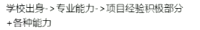

# HR 面试软技能 

6+2 调整

1. 你最擅长的技术方向是什么?
2. 最能概括自己的三个词是什么?
   1. 聪明
   2. 乐观
   3. 踏实
   4. 皮实
   5. 靠谱
3. 作为面试者给我打一下分
4. 你怎么理解你应聘的职位
5. 喜欢这个工作的哪一点 
   1. 对工作的极大兴趣
6. 为什么要离职
   1. 客观理由:   疫情影响
   2. 主管理由：
      1. 为了遇到这家公司
      2. 公司与我的职业规划不符
      3. 我想来到贵公司
      4. 工作不是全部，生活也要兼顾
      5. 能力提升，未来规划
      6. 客观原因，与领导公司
7. 简历空档期
   1. 家里有事
   2. 找客观原因
   3. 疫情原因，家里有事
8. 说说你对行业、技术发展趋势的看法
   1. 说数字，有说服力
   2. 看行业
   3. TDD,DDD
9. 对工作的期望于目标何在
   1. 未来规划
   2. 低配版：认真完成工作
10. 说说家庭
    1. 家庭和睦
    2. 没有负担
11. 就你申请这个职位，你认为你还欠缺什么
    1. 一个熟悉新业务的过程
12. 你欣赏那种性格的人
    1. 乐于分享
    2. 开诚布公
13. 你通常如何处理别人的批评?
    1. 分析原因
    2. 项目失败的原因
    3. 说具体的失败问题
    4. 根据以前的失败，为新的公司做预防
14. 什么会让你有成就感
    1. 我能为公司做什么
    2. 我能在公司中做什么
    3. 在公司中获得了那些成功
15. 眼下你生活中最重要的是什么?
    1. 现阶段提升自己
    2. 提升自己最需要的
16. 你为什么愿意到我们公司来工作?
    1. 当前行业的看好
    2. 进一步提升自己
17. QPS使用Jennter进行压测
18. 如果我录用你，你将怎样开展工作?
    1. 如何提前了解这个岗位的话，你可以说一下，但是要有条理性。哪怕错了，但是也要进去一下。
    2. 如果不知道的话，那就说服从领导安排，
    3. 空降，公司内耗，队伍战队
19. 你希望与什么样的上级共事？
    1. 

