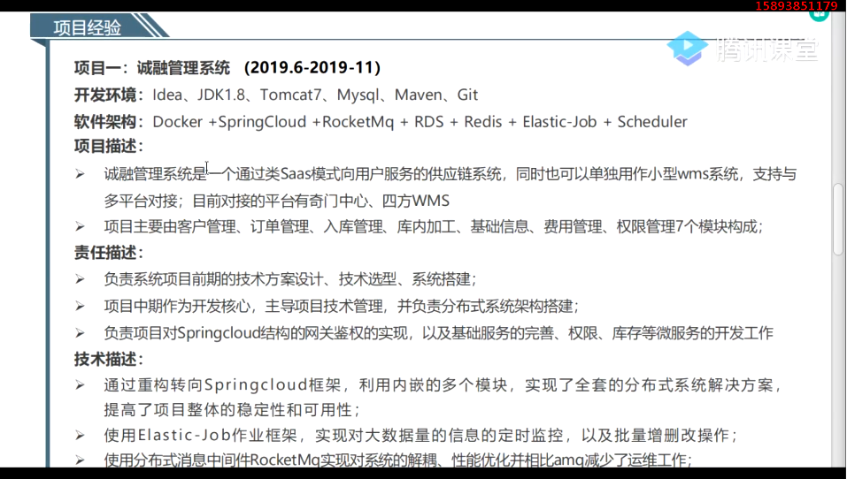
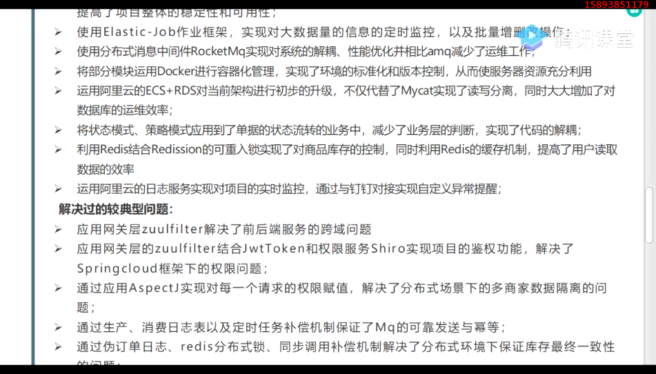
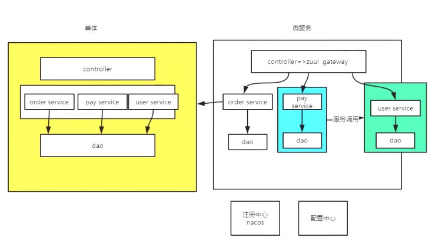
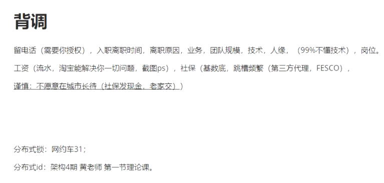
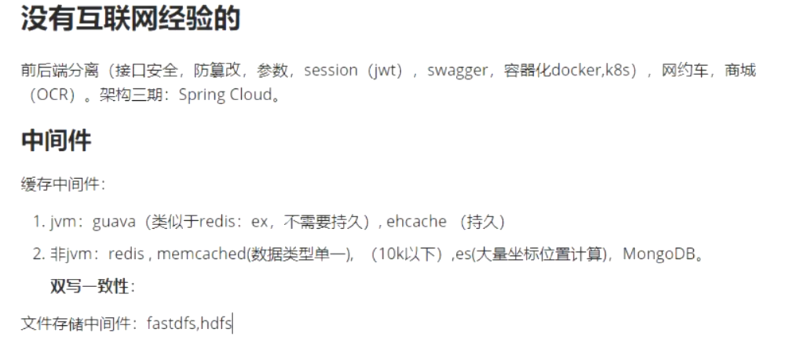

# 项目指导

# 靠技术解决

> 蚂蚁金服面试经验

项目怎么写

1. 业务、周期、架构、技术、规模（人员）、角色、数据量、并发量、该井的想法、你的成长、烦死
2. 个人职责
   1. 技术开发职责
      1. 业务沟通，技术选型，环境搭建
   2. 团队管理
      1. 进度管理，任务配合
   3. 架构设计能力
      1. 测试结果（qps,tps）
      2. 工具（禅道，jira）
   4. 难点
      1. JVM调优
      2. sql调优
      3. qps提升
      4. 接口优化（响应时间长（调用链路长，连接数少，代码冗余））

项目描述+个人职责

面试管常见问题

没有项目经验（应届生，转行的）

没有微服务项目经验的

脑补：原来项目，包装成微服务

# 没有互联网项目经验的

前后端分离（接口安全，防篡改参数，session(JWT)，Swagger，容器化docker，k8s, 网约车，商城（OCR））,架构三期：Spring Cloud.

中间件：

缓存中间件： 

1. jvm :  guava(可以设置超时时间，类似于redis的ex,不需要持久化), ehcache（持久化，覆盖掉jvm，分布式）

2. 非JVM：redis（小于10K，并没有大的并发量,单线程）, memcached(数据类型单一)，ES（大量坐标位置计算），MongoDB（文本数据库适合存一些BBS，）,。 

   **双写一致性**：先写Msql然后在写reids

文件存储中间件：ftp（别写），fastdfs（超低价值的数据，用户的数据，买家秀买家秀）,hdfs（提供生态的东西，需要鉴别的东西，敏感词，图片中的违规信息），云存储（oss-阿里，7牛，s3;  云存储的SDK 上传oss，oss返回url，我们再将url存储到数据库,）,es(文本，权限，逻辑判断，日志文件)

数据库中间件：shardingsphere(Apache 的顶级开源项目),mycat（就不在说了，作者的野史）

消息队列中间件：Kafka,RocketMQ（最可靠的消息传输）,RabbitMQ,ActiveMQ

定位：hals msg;

优势对比：成熟团队选（Kafka）,bus（RabbitMQ,Kafka）,RocketMQ（事务消息）

接入层中间件： nginx（HAproxy,tengine,Openrestry）+keepalived（检测心跳，做IP漂移）,lvs(Linux系统内核中，有隧道模型和不走隧道模型，dr ,tun),slb(阿里云有卖的),dns,cdn（内容分发，用户区域），F5（硬件的）

LVS+keepalived(做主备切换，做ip切换时，一般是一台性能好的，一台性能不好的) + nginx ;   可以抗住一些的流量

>  nginx能不能做四层的网络负载,可以做四层的网络负载，但是需要借助一个模块。

> 自圆启慧:   坚定自己的看法

# 没有高并发经验的

看上面

erp：在线聊天，群发通知

oa：上下班打卡。

自己找需求

响应了才叫qps; 以秒为单位

**合并请求**前端支持，后端支持。

网约车如何写

电子商城怎么写

亿级流量怎么写

合家云项目怎么写

毕业设计怎么写

异地多活，指的是服务多活，数据不多活（数据中心）

