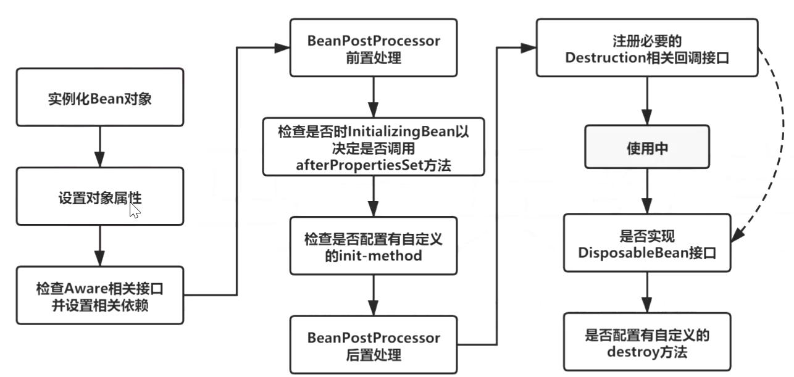

# Spring

答题技巧：

总：当前问题回答的是那些具体的点

分：以1，2，3，4，5的方式分细节取描述相关的知识点，如果有哪些点不清楚，直接忽略过去

​		突出一些技术名词（核心概念，接口，类，关键方法）

​		避重就轻：没有重点

一个问题能占用面试官多少时间？问的越多可能露馅越多

当面试官问到一个你熟悉的点的时候，一定要尽量拖时间

# 1.谈谈Spring IOC的理解，原理与实现?

**总：**

控制反转：理论思想，原来的对象是由使用者来进行控制，有了spring之后，可以把整个对象交给spring来帮我们进行管理

​				DI：依赖注入，把对应的属性的值注入到具体的对象中，@Autowired，populateBean完成属性值的注入

容器：存储对象，使用map结构来存储，在spring中一般存在三级缓存，singletonObjects存放完整的bean对象,

​			整个bean的生命周期，从创建到使用到销毁的过程全部都是由容器来管理（bean的生命周期）

**分：**

1、一般聊ioc容器的时候要涉及到容器的创建过程（**beanFactory**,**DefaultListableBeanFactory**）,向bean工厂中设置一些参数（**BeanPostProcessor**,**Aware**接口的子类）等等属性

2、加载解析bean对象，准备要创建的bean对象的定义对象**beanDefinition**,(xml或者注解的解析过程)

3、**beanFactoryPostProcessor**的处理，此处是扩展点，**PlaceHolderConfigurSupport**,**ConfigurationClassPostProcessor**

4、**BeanPostProcessor**的注册功能，方便后续对bean对象完成具体的扩展功能

5、通过反射的方式讲**BeanDefinition**对象实例化成具体的bean对象，

6、bean对象的初始化过程（填充属性，调用aware子类的方法，调用**BeanPostProcessor**前置处理方法，调用**init-mehtod**方法，调用**BeanPostProcessor**的后置处理方法）

7、生成完整的bean对象，通过**getBean**方法可以直接获取

8、销毁过程

面试官，这是我对ioc的整体理解，包含了一些详细的处理过程，您看一下有什么问题，可以指点我一下（允许你把整个流程说完）

您由什么想问的？

​			老师，我没看过源码怎么办？

​		具体的细节我记不太清了，但是**spring中的bean都是通过反射的方式生成的**，同时其中包含了很多的扩展点，比如最常用的对BeanFactory的扩展，对bean的扩展（对占位符的处理），我们在公司对这方面的使用是比较多的，除此之外，ioc中最核心的也就是填充具体bean的属性，和生命周期（背一下）。

# 2.谈一下spring IOC的底层实现

底层实现：工作原理，过程，数据结构，流程，设计模式，设计思想

你对他的理解和你了解过的实现过程

反射，工厂，设计模式（会的说，不会的不说），关键的几个方法

createBeanFactory，getBean,doGetBean,createBean,doCreateBean,createBeanInstance(getDeclaredConstructor,newinstance),populateBean,initializingBean

1、先通过**createBeanFactory**创建出一个Bean工厂（**DefaultListableBeanFactory**）

2、开始循环创建对象，因为容器中的bean默认都是单例的，所以优先通过**getBean**,**doGetBean**从容器中查找，找不到的话，

3、通过**createBean**,**doCreateBean**方法，以反射的方式创建对象，一般情况下使用的是无参的构造方法（**getDeclaredConstructor**，**newInstance**）

4、进行对象的属性填充**populateBean**

5、进行其他的初始化操作（**initializingBean**）

# 3.描述一下bean的生命周期 ？

背图：

> 设置对象属性会有: 循环依赖的问题，循环依赖又能带出三级缓存的问题

在表述的时候不要只说图中有的关键点，要学会扩展描述

1、实例化bean：反射的方式生成对象

2、填充bean的属性：populateBean(),循环依赖的问题（三级缓存）

3、调用aware接口相关的方法：invokeAwareMethod(完成BeanName,BeanFactory,BeanClassLoader对象的属性设置)

4、调用BeanPostProcessor中的前置处理方法：使用比较多的有（ApplicationContextPostProcessor,设置ApplicationContext,Environment,ResourceLoader,EmbeddValueResolver等对象）

5、调用initmethod方法：invokeInitmethod(),判断是否实现了initializingBean接口，如果有，调用afterPropertiesSet方法，没有就不调用

6、调用BeanPostProcessor的后置处理方法：spring的aop就是在此处实现的，AbstractAutoProxyCreator

​		注册Destuction相关的回调接口：钩子函数

7、获取到完整的对象，可以通过getBean的方式来进行对象的获取

8、销毁流程，1；判断是否实现了DispoableBean接口，2，调用destroyMethod方法

# 4.Spring 是如何解决循环依赖的问题的？

三级缓存，提前暴露对象，aop

总：什么是循环依赖问题，A依赖B,B依赖A

分：先说明bean的创建过程：实例化，初始化（填充属性）

​		1、先创建A对象，实例化A对象，此时A对象中的b属性为空，填充属性b

​		2、从容器中查找B对象，如果找到了，直接赋值不存在循环依赖问题（不通），找不到直接创建B对象

​		3、实例化B对象，此时B对象中的a属性为空，填充属性a

​		4、从容器中查找A对象，找不到，直接创建

​		形成闭环的原因

​		此时，如果仔细琢磨的话，会发现A对象是存在的，只不过此时的A对象不是一个完整的状态，只完成了实例化但是未完成初始化，如果在程序调用过程中，拥有了某个对象的引用，能否在后期给他完成赋值操作，可以优先把非完整状态的对象优先赋值，等待后续操作来完成赋值，相当于提前暴露了某个不完整对象的引用，所以解决问题的核心在于实例化和初始化分开操作，这也是解决循环依赖问题的关键，

​		当所有的对象都完成实例化和初始化操作之后，还要把完整对象放到容器中，此时在容器中存在对象的几个状态，完成实例化=但未完成初始化，完整状态，因为都在容器中，所以要使用不同的map结构来进行存储，此时就有了一级缓存和二级缓存，如果一级缓存中有了，那么二级缓存中就不会存在同名的对象，因为他们的查找顺序是1，2，3这样的方式来查找的。一级缓存中放的是完整对象，二级缓存中放的是非完整对象

​		为什么需要三级缓存？三级缓存的value类型是ObjectFactory,是一个函数式接口，存在的意义是保证在整个容器的运行过程中同名的bean对象只能有一个。

​		如果一个对象需要被代理，或者说需要生成代理对象，那么要不要优先生成一个普通对象？要

​		普通对象和代理对象是不能同时出现在容器中的，因此当一个对象需要被代理的时候，就要使用代理对象覆盖掉之前的普通对象，在实际的调用过程中，是没有办法确定什么时候对象被使用，所以就要求当某个对象被调用的时候，优先判断此对象是否需要被代理，类似于一种回调机制的实现，因此传入lambda表达式的时候，可以通过lambda表达式来执行对象的覆盖过程，getEarlyBeanReference()

​		因此，所有的bean对象在创建的时候都要优先放到三级缓存中，在后续的使用过程中，如果需要被代理则返回代理对象，如果不需要被代理，则直接返回普通对象

# 4.1缓存的放置时间和删除时间

​		三级缓存：createBeanInstance之后：addSingletonFactory

​		二级缓存：第一次从三级缓存确定对象是代理对象还是普通对象的时候，同时删除三级缓存 getSingleton

​		一级缓存：生成完整对象之后放到一级缓存，删除二三级缓存:addSingleton

# 5.Bean Factory与FactoryBean有什么区别？

相同点：都是用来创建bean对象的

不同点：使用**BeanFactory**创建对象的时候，必须要**遵循严格的生命周期流程**，**太复杂了**，，如果想要简单的自定义某个对象的创建，同时创建完成的对象想交给spring来管理，那么就需要实现**FactroyBean**接口了

​			isSingleton:是否是单例对象

​			getObjectType:获取返回对象的类型

​			getObject:自定义创建对象的过程(new，反射，动态代理)

# 6.Spring中用到的设计模式? 

单例模式：bean默认都是单例的

原型模式：指定作用域为prototype

工厂模式：BeanFactory

模板方法：postProcessBeanFactory,onRefresh,initPropertyValue

策略模式：XmlBeanDefinitionReader,PropertiesBeanDefinitionReader

观察者模式：listener，event，multicast

适配器模式：Adapter

装饰者模式：BeanWrapper

责任链模式：使用aop的时候会先生成一个拦截器链

代理模式：动态代理

委托者模式：delegate

。。。。。。。。。

# 7.Spring的AOP的底层实现原理? 

动态代理

aop是ioc的一个扩展功能，先有的ioc，再有的aop，只是在ioc的整个流程中新增的一个扩展点而已：**BeanPostProcessor**

总：aop概念，应用场景，**动态代理**

分：

​		bean的创建过程中有一个步骤可以对bean进行扩展实现，aop本身就是一个扩展功能，所以在BeanPostProcessor的后置处理方法中来进行实现

​		1、代理对象的创建过程（advice，切面，切点）

​		2、通过jdk或者cglib的方式来**生成代理对象**

​		3、在执行方法调用的时候，会调用到生成的字节码文件中，直接回找到DynamicAdvisoredInterceptor类中的intercept方法，从此方法开始执行

​		4、根据**之前定义好的通知来生成拦截器链**

​		5、从**拦截器链中依次获取每一个通知开始进行执行**，在执行过程中，为了方便找到下一个通知是哪个，会有一个CglibMethodInvocation的对象，找的时候是从-1的位置一次开始查找并且执行的。

# 8.Spring的事务是如何回滚的?

​		spring的事务管理是如何实现的？

​		总：spring的事务是由aop来实现的，首先要生成具体的**代理对象**，然后按照aop的整套流程来执行具体的操作逻辑，**正常情况下要通过通知来完成核心功能，但是事务不是通过通知来实现的**，而是通过一个**TransactionInterceptor**来实现的，然后调用**invoke**来实现具体的逻辑

​		分：1、先做准备工作，解析各个方法上事务相关的属性，**根据具体的属性来判断是否开始新事务**

​				2、当**需要开启**的时候，获取**数据库连接**，**关闭自动提交功能**，**开起事务**

​				3、执行具体的sql逻辑操作

​				4、在操作过程中，如果执行失败了，那么会通过**completeTransactionAfterThrowing**看来完成事务的回滚操作，回滚的具体逻辑是通过**doRollBack**方法来实现的，实现的时候也是要先获取连接对象，通过连接对象来回滚

​				5、如果执行过程中，没有任何意外情况的发生，那么通过**commitTransactionAfterReturning**来完成事务的提交操作，提交的具体逻辑是通过doCommit方法来实现的，实现的时候也是要获取连接，通过连接对象来提交

​				6、当事务执行完毕之后需要清除相关的事务信息**cleanupTransactionInfo**

如果想要聊的更加细致的话，需要知道TransactionInfo,TransactionStatus,

# 9.谈一下spring事务传播？

​			传播特性有几种？7种

			1. Required
   			2. Requires_new
      			3. nested
         			4. Support
            			5. Not_Support
               			6. Never
                  			7. Mandatory

​			某一个事务嵌套另一个事务的时候怎么办？

​			A方法调用B方法，AB方法都有事务，并且传播特性不同，那么A如果有异常，B怎么办，B如果有异常，A怎么办？

--------

​			总：事务的传播特性指的是**不同方法的嵌套调用过程中**，事务应该如何进行处理，是用同一个事务还是不同的事务，当出现异常的时候会回滚还是提交，两个方法之间的相关影响，在日常工作中，使用比较多的是**required**，**Requires_new**,**nested**

​			分：1、先说事务的不同分类，可以分为三类：**支持当前事务**，**不支持当前事务**，**嵌套事务**

​					2、如果外层方法是required，内层方法是，required,requires_new,nested

​					3、如果外层方法是requires_new，内层方法是，required,requires_new,nested

​					4、如果外层方法是nested，内层方法是，required,requires_new,nested

找工作：

1、面试之前一定要调整好心态，不管你会多少东西，干就完了，出去面试就一个心态，老子天下第一，让自己超常发挥

2、得失心不要太重，全中国企业很多，好公司也有很多，没必要在一棵树上吊死，你可以有心仪的公司，留到最后，等你准备充分再去

3、找工作永远不可能准备好，很多同学怂，心态不好，不敢出去面试，我要准备，先按照你的技术储备取尝试一些公司（我就是来试水的）面试回来之后做总结，做好准备，不断总结，复盘，这样才能成长

4、希望大家保持好信息互通，乐于分享

