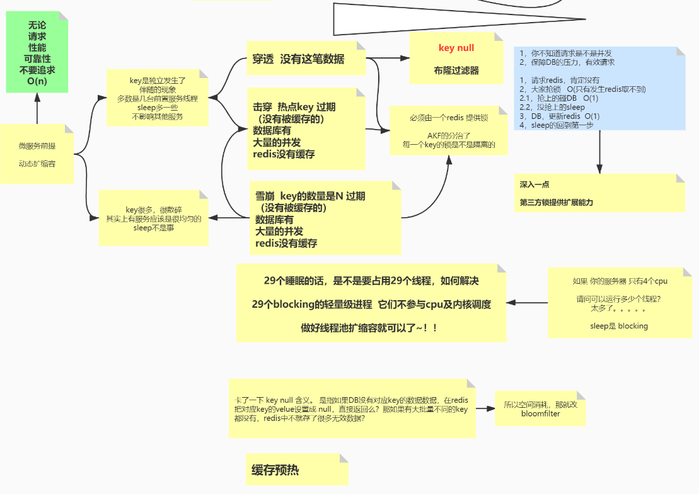
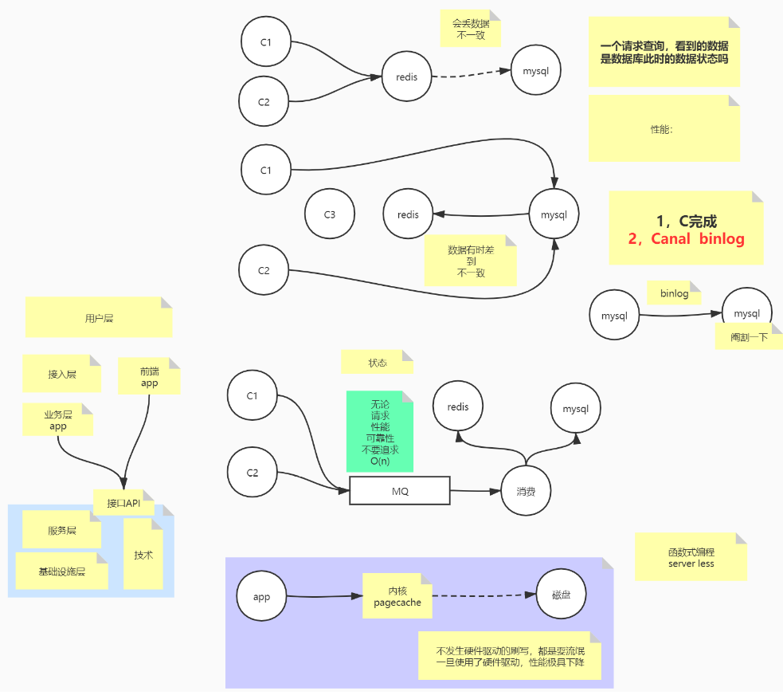

# Redis

# REDIS常见面试题解析：

## 课堂上没有梳理出来的问题，统一发送给班主任

我会录视频累积面试题，这样的话这个课可以一直看，增量更新；

最近报名的人很多，最主要咱们以前报名的小伙伴，很多来做规划，改简历，工作量真的真的很大！

你们也辛苦一点，多催着点老师。

---


1. 说一下你在项目中的redis的应用场景？

   ```
   1，5大value类型：根据我的redis课有场景的介绍
   2，基本上就是缓存~！
   3，为的是服务无状态，延申思考，看你的项目有哪些数据结构或对象，在单机里需要单机锁，在多机需要分布式锁，抽出来放入redis中；
   4，无锁化
   ```

2. redis是单线程还是多线程？

   ```
   1，无论什么版本，工作线程就是一个
   2，6.x高版本出现了IO多线程
   3，使用上来说，没有变化
   ------
   3，[去学一下系统IO课]，你要真正的理解面向IO模型编程的时候，有内核的事，从内核把数据搬运到程序里这是第一步，然后，搬运回来的数据做的计算式第二步，netty
   4，单线程，满足redis的串行原子，只不过IO多线程后，把输入/输出放到更多的线程里去并行，好处如下：1，执行时间缩短，更快；2，更好的压榨系统及硬件的资源(网卡能够高效的使用)；
   *，客户端被读取的顺序不能被保障
   那个顺序时可以被保障的：在一个连接里，socket里
   ```

   

3. redis存在线程安全的问题吗？为什么？

   ```
   重复2中的单线程串行
   redis可以保障内部串行
   外界使用的时候要保障，业务上要自行保障顺序~！
   ```

4. 遇到过缓存穿透吗？详细描述一下。

5. 遇到过缓存击穿吗？详细描述一下。

6. 如何避免缓存雪崩？

   ```
   以上问题，核心就是避免DB无效/重复请求，结合图去理解
   涉及一些架构思想上的提升
   ```

   

7. Redis是怎么删除过期key的？

8. 缓存如何回收的？

   ```
   1，后台在轮询，分段分批的删除哪些过期的key
   2，请求的时候判断时候已经过期了
   尽量的把内存无用空间回收回来~！
   ```

9. 缓存是如何淘汰的

   ```
   0，内存空间不足的情况下：
   1，淘汰机制里有不允许淘汰
   2，lru/lfu/random/TTL
   3，全空间
   4，设置过过期的key的集合中
   ```

10. 如何进行缓存预热？

    ```
    1，提前把数据塞入redis，(你知道那些是热数据吗？肯定不知道，会造成上线很多数据没有缓存命中)
    2，开发逻辑上也要规避差集(你没缓存的)，会造成击穿，穿透，雪崩，实施456中的锁方案
    3，一劳永逸，未来也不怕了
    *，结合4，5，6点去看，看图理解
    ```

11. 数据库与缓存不一致如何解决？

    ```
    1，恶心点的，我们可以使用分布式事务来解决，（意义不大），顶多读多，写稀有情况下
    结合图去思考
    1，redis是缓存，更倾向于稍微的有时差
    2，还是减少DB的操作
    3，真的要落地，咱就canal吧
    ```

12. 简述一下主从不一致的问题？

    ```
    1，redis的确默认是弱一致性，异步的同步
    2，锁不能用主从(单实例/分片集群/redlock)==>redisson
    3，在配置中提供了必须有多少个Client连接能同步，你可以配置同步因子，趋向于强制一性
    4，wait 2 0  小心
    5，34点就有点违背redis的初衷了
    ```

13. 描述一下redis持久化原理？

    ```
    当前线程阻塞服务 不聊
    异步后台进程完成持久
    fork  +  cow
    ```

14. Redis有哪些持久化方式？

    ```
    1，RDB，AOF；主从同步也算持久化；
    2，高版本：开启AOF，AOF是可以通过执行日志得到全部内存数据的方式，但是追求性能：
    2.1，体积变大，重复无效指令  重写，后台用线程把内存的kv生成指令写个新的aof
    2.2，4.x 新增更有性能模式：把重写方式换成直接RDB放到aof文件的头部，比2.1的方法快了，再追加日志
    ```

15. Redis也打不住了，万级流量会打到DB上，该怎么处理？

    ```
    见456
    ```

16. redis中的事务三条指令式什么，第三条指令到达后执行失败了，怎么处理

    ```
    见图
    ```

    

17. redis实现分布式锁的指令

18. 为什么使用setnx？

    ```
    1，好东西，原子（不存在的情况下完成创建）
    2，如果要做分布式锁，就要用set k v nx ex  (不存在，过期时间，避免死锁)
    ```

19. 分布式锁实现，理论：

    ```
    
    ```

---

1. 说一下你在项目中的Redis的应用场景。

   1. 5大 Value类型；
   2. 基本上就是缓存
   3. 为的是服务无状态，延伸思考
   4. 热点数据，共享Session

2. Set、Zset分别用于哪些场景?

   1. set  关联、推荐与字典之类的
   2. Zset  排名与排序

3. Redis是单线程还是多线程

   1. 无论什么版本，工作线程就一个
   2. 6.x 高版本出现了IO 多线程
   3. MMP  零拷贝

4. 缓存是如何回收的?

   >  LRU,LYF
   >
   > 淘汰策略
   >
   > 删除的话，随机删除
   >
   > 定期删除+惰性删除

5. 双写一致性的问题？

