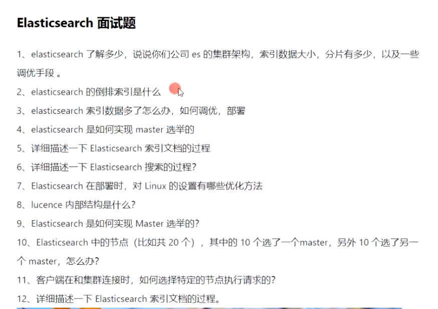
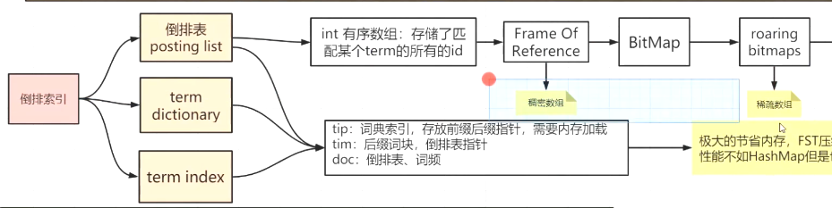
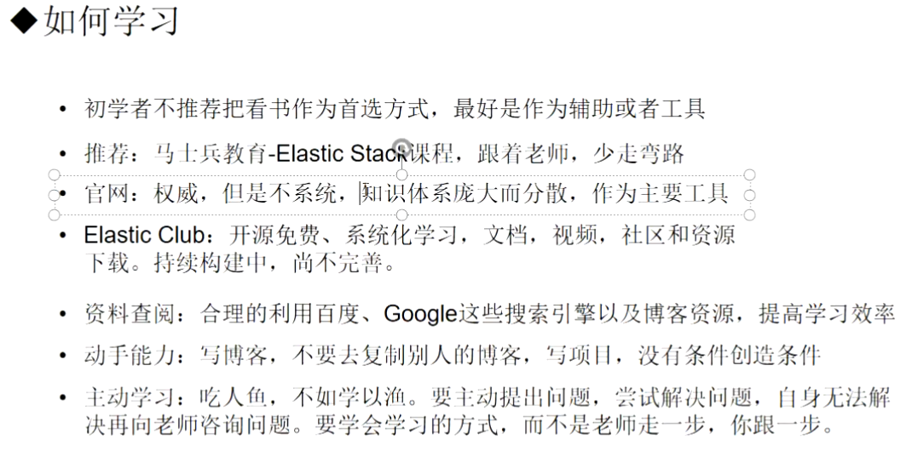

> ES   会有详细的整理

倒排索引

字典序排列

mormaliza

倒排表

sORre,

BM25   TDIDF

FST

for   mbf

**FSM**：

**FSA**  :  有限状态接收机

**FST**:  有限状态转换机

通用最小化算法

 examples.mikemccandless.com/fst.py

ES的写入原理。

垂直搜索  淘宝

百度  全文搜索 

