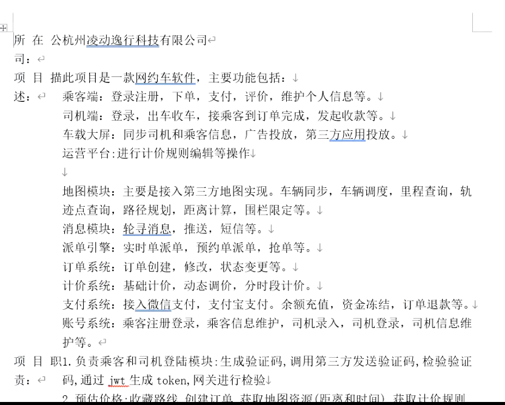
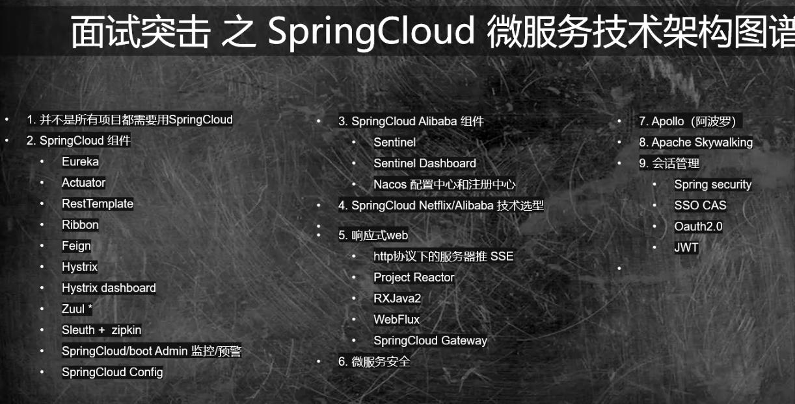

# 微服务

工作断层：接私活

限流：网关的过滤器里面，使用google的Gava的limit

配置中心使用时在项目中要通过Bootstrapt.yml 进行使用

中间件  Redis mq

如何响应高并发的请求，将一些请求滞后，快熟响应，比如支付订单时的中间态。

服务失败时，可以通过熔断和降级

熔断：消费端调用提供端时，经过多次进行请求，掉不通，打开熔断开关，当服务在调用该服务时，直接返回响应，不在调用服务提供者。

熔断开关打开之后，默认过了30s的时间，将熔断开关设置为半开状态，尝试请求服务提供者，如果还是不行，再将熔断开关继续打开。

betwen

**网约车文档**

---

1. 并不是所有项目都需要用SpringCloud

   CRM 

   业务复杂，计算庞大

   要有层级，

   架构如果拖累业务就不行了

   SOA  就是基 与服务的架构

   WebServer

2. Spring 组件

dubbo与Feign实际上是通过生成一个代理类，然后在网关层在使用的时候，通过@AutoWrired 注入进去进行了实例化的操作。

代理类触发invoke() 开socket进行服务调用。

