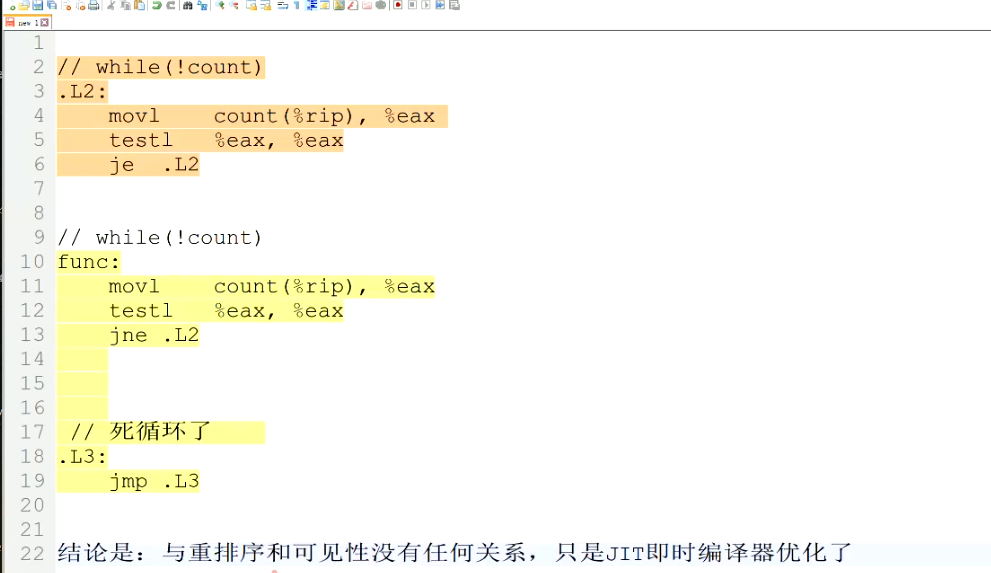
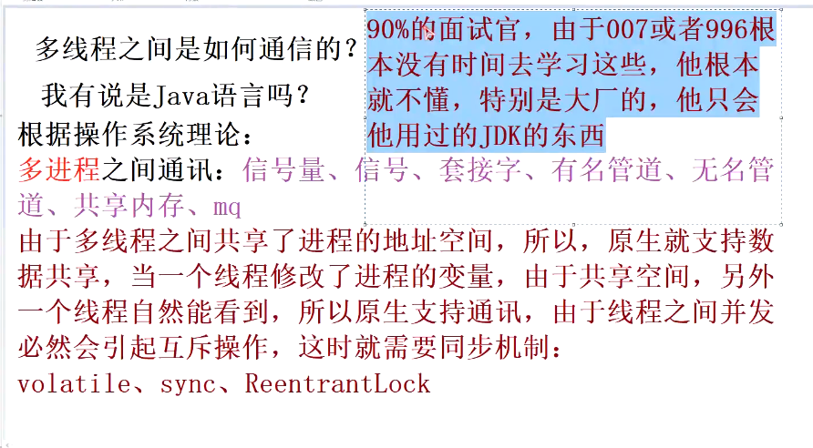
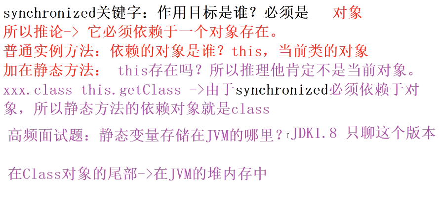
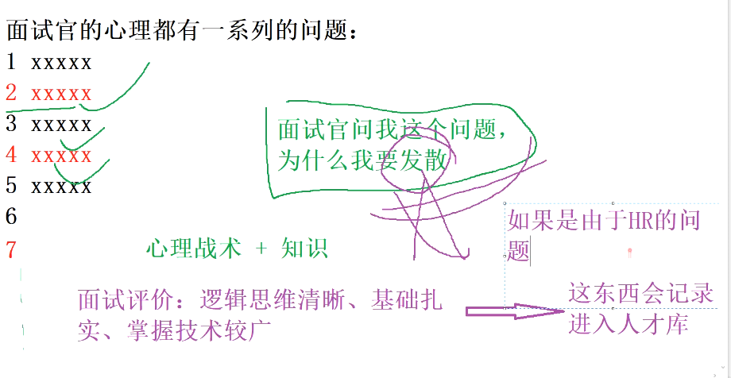
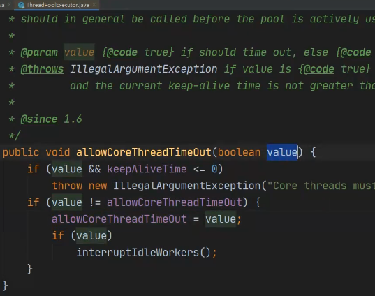
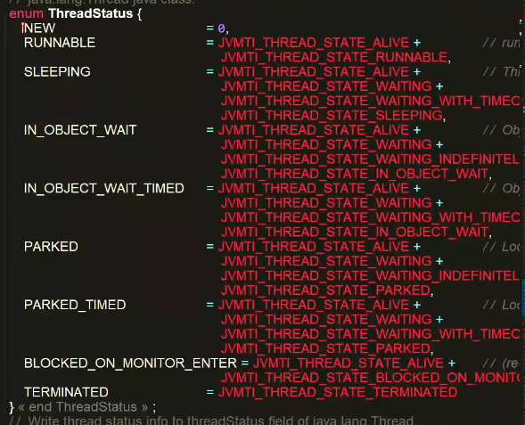
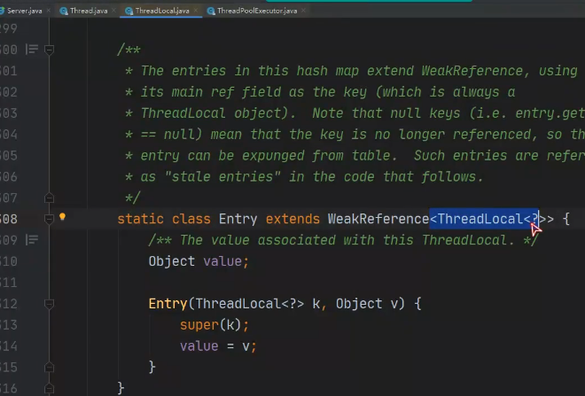

1. 程序开多少线程合适？

CPU密集型减少线程切换

IO密集型 讨论线程要停顿多少时间

> CPU的二倍是通用的解决方案

看吞吐量和时间延时

2. 描述一下notify和notifyAll区别?

   > 这个时候面试官想问的是，Sync的底层原理。

   CSQ
   
3. CountDownLatch的原理是   AQS共享锁+state变量

整型的最大值为2的31次方减一。

newCachePoolThread();  最大值为Integer.max   线程数过大

 

1. 什么是并发，什么是并行？

   并发：单位时间多个请求轮流执行，没有个请求分的一定的运行时间，当这些运行时间足够短的时候，就成了伪并行。就像动画片

   并行：多个请求同时运行

   如果将并行时间足够短1nms就成了并行。

2. 并发与并行会造成什么影响？

   线程、任务之间会发生任务争抢，有可能会造成死锁。

3. 如何解决这些影响？

   同一个时间只能有一个线程去执行这块资源。

   需要上锁，要不然可能会有插队。ReentLock,可重入的lock

   在操作系统中叫做线程互斥。可以引入管程（也叫作管理程序的线程）

   ReentLock管理线程，那又是什么去管理管程的呢?  

   就引入了 原子P操作，原子V操作

   是谁让CPU在执行的时候换了任务？---> 时钟中断

   每隔100ms发送个CPU切换任务。

   lock dec:  -- 减减操作

   lock Incr;  ++  加加操作

   lock 保证了这个操作是原子性的。

   dcl的原子性操作。

4. 操作系统基本概念   聊一下?

**CAS**

1. 对象
2. 对象偏移量
3. 期待值
4. 改变的新值

**简单描述一下ABA问题**

解决加版本号，每次修改加一

加时间戳会有问题，格式不定，精度不定，太长了

SeqLock锁通过版本进行控制。Linux内核中

**实现一下DCL**

Sync有两个对列，一个竞争对列，一个等待对列。

面试时，对方问问题，自己回答问题，其中技巧在于扩展自己答案中的扩展点。

**实现一个阻塞对列（用Condition 写生产者与消费者）**

互斥锁  信号量  互斥量  条件变量

条件等待对列，且叫条件变量

ArrayBlockingQueue  中定义了两个Condition一个叫notEmpty,另一个叫notFull

Condition 通过signal()进行唤醒，通过await()进行等待

LockSupport  park/unpark

#  CountDownLatch的原理是？

ASQ+共享锁

# Executor实现了几种线程池？

缓存，没有队列

先答ThreadPool的七个参数，这里面用了什么

os中的虚拟地址，线性地址，逻辑地址

int  的最大值为 2的三十一次方减一，那个1代表了符号位。数组下表从零开始0AABB

Integer.max   -127~128 

# 任务在线程池中的执行过程

1. 任务进入线程池，任务数小于核心线程的情况下，直接执行当前线程
2. 如果任务数超过核心线程数，放到等待队列
3. 如果等待队列满了， 看有没有超过最大线程数，如果没有，创建最大线程数，拿等待队列中的任务
4. 如果等待队列满了，看有没有超过最大线程数，如果超过了，没法容纳了，直接执行拒绝策略

ASQ+state

## 任务结束会不会回收线程

1. 任务结束回收线程，是要看，是核心线程，还是非核心线程。
2. 如果是非核心线程，当等待一段时间没有拿到任务，非核心线程就会超时回收，而，如果指定了允许核心线程数睡眠，非核心线程数也可以进行睡眠。
3. 线程保存在Works的数组里面，这个works是HashSet，由于works是非线程安全的，所以一把ReentLock的全局锁，保证线程安全。

设置线程池的主线程是否可以失眠。

多线程的状态

 

# G1什么时候引发Full  GC

G1的清除速度，赶不上工作线程的分配速度。

G1的内存空间理论上是无界的。

# 缓存预热有什么解决方法

电商秒杀：后台添加调度任务，线上添加出发任务，生成一个文件，

将数据冲数据库添加到缓存里面

#### 为什么转红黑树要hashMap长度要达到8？

不是hashMap的长度要达到64，没有达到64时，hash冲突已经很大了，这个时候要先将数组扩展，将数组增大到64，在数组无法容忍的情况下，才会将链表转化为红黑树。

##### 怎么保证缓存和数据库的一致性

先写数据库，在修改缓存，然后通过定时任务进行校准缓存与数据库的一致性，然后根据业务的时效性，调整定时任务的出发时间。

##### 解决hash冲突有什么好的办法?

> hash算法，xol算法也叫差异或算法

扩容重新哈希，然后编写更加优秀的哈希算法，

**对象引用在栈内存**

