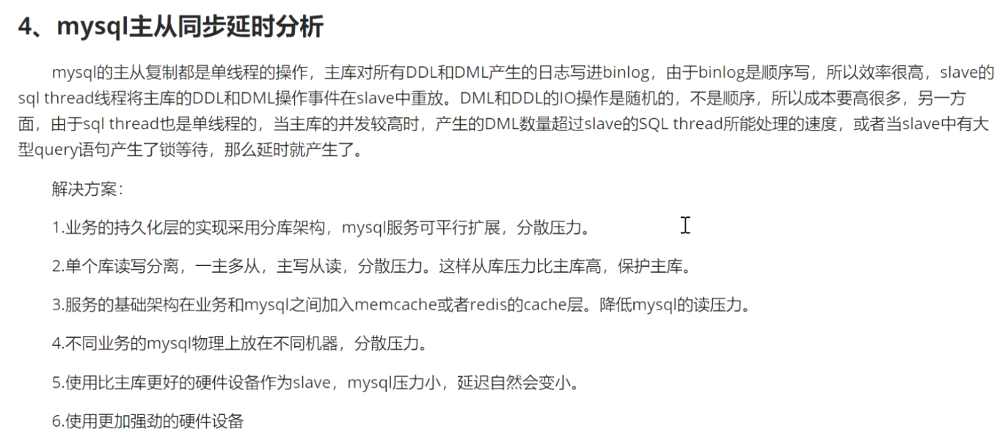

# MySQL

当数据库行的历史版本放在UndoLog中。


IX 意向排它锁

X  临键锁

MySQL  打开一个关于所得属性值，然后通过了 show innodb .. 可以查看关于锁的日志。

> 幻读是不可重复度的子类。

MySQL  加锁是加在索引上的。

innodb 中没有索引的话， 锁的是表，有索引的话，锁的是行。


JOIN的几种方式

Simple （笛卡尔积）、Index（需要join的列上有索引）、Block（没有索引时使用，但是会将驱动表中的列加载到 Join Buffer中，全部与非驱动表中的关联列作对比。连接缓存区大小join_buffer_size默认为256K）

> MySQL 中查看属性值设置  
>
> ```shell
> show variables like 'join_buffer_size'
> ```


----


谈索引的时候一定要谈两个点，一个是IO,一个是数据结构。

MySQL 中所有的数据都是存在磁盘里面的。

IO：

​	1. 读取次数少，量少

​	2. 分块读取

​	3. 局部性原理，磁盘预读

数据数据结构

	1. B+树
 	2. 二叉树、AVL、红黑树、B树 

​	 


MySQL的分库分表

> MMM  master master 集群
>
> MHA   MySQL 高可用集群  HAProxy
>
> MRG   

数据库做切分之前，一定要做好业务规划，以及未来的业务增长。

数据库能不切分就不切分。

大部分都是利用空间换时间

MySQL数据集群主要分为三种模式：

1. 主从复制 是前提 下面两个是应用
2. 读写分离
3. 分库分表


> sqoop  数据库之间传送数据

ORC 文件格式     ORC（列式存储文件）


主从复制的调用过程


Relay Log：实现了顺序IO；；

与随机IO





> MySQL之间的版本对比


# 行锁与间隙锁

1. 主键加行锁，索引间隙锁
2. 确定唯一值的就是行锁，确定不了唯一值的就是间隙锁


3. 加哪个锁，关键的是使用是的哪个行锁。

> 查询数据库不会产生幻读问题，不需要加**临键锁**和**行锁**

间隙锁： 两边都开 ()

临键锁：左开右闭（]


RC 解决脏读问题，但不解决重复读问题

RR 解决幻读问题

> RR与RC最大的区别是什么:
>
> 最大区别是：read View 的创建时机。

