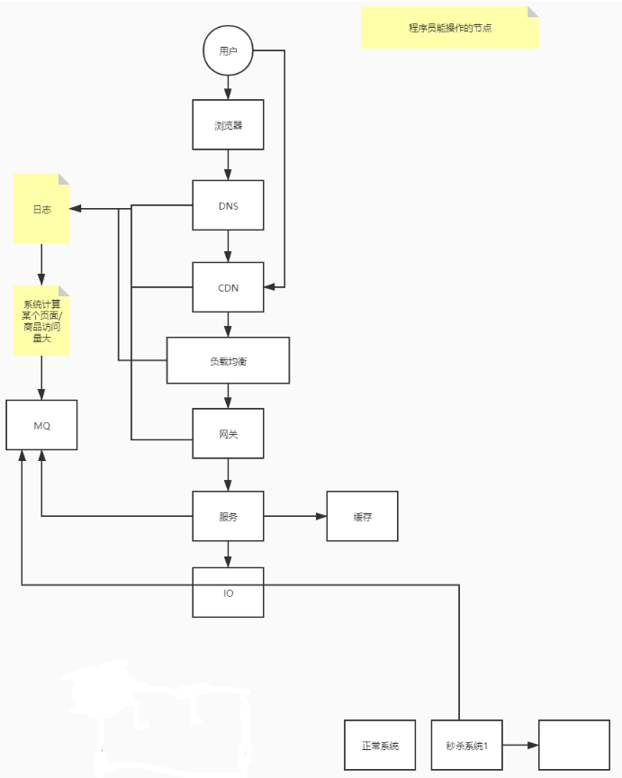
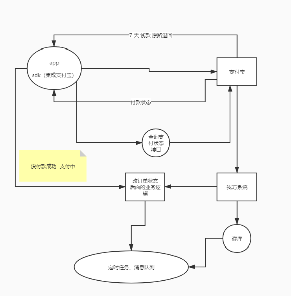

# 秒杀

# 什么是秒杀

1. 短时间（瞬时）
2. 大量请求
3. 买一个（数量少）商品。

> **解决：高并发（读，写）**

# 秒杀系统目标

**稳**：

​	高可用，系统稳定的提供服务。

**准**：

​	超卖。数据一致性问题。

**快**：

​	高性能。（优化的点）

# 架构原则

## 较少用户和服务端的交互

1. **数据要少**

   ​		请求参数和相应参数要少，降低对网络带宽的占用，降低对cpu的消耗，对IO数据库。（非必要的信息不要来回传）。

2. **请求数要少**

   ​		合并请求。

3. **路径要短**

   ​		每个节点可靠性：99%，5个节点：95%。

4. **依赖要少**（去除无效的功能，保留核心功能）

   ​		花里胡哨的减少。优先级高的展示，低的去掉。

5. **不要单点** （集群部署）

   ​		保证高可用：负载均衡，水平扩展，（relicate:数字（K8s中的例子））docker image（服务+DB volume）

   

## 动静数据分离

1. 数据区分：

   1. url,用户，
   2. 浏览的时间，
   3. 地域，
   4. cookie(缓存信息)-> 静态数据，
   5. cdn,负载均衡

   

   对请求进行区分url（商品详情），url1 : 详情 （json）

   放到离用户最近的地方，cdn （浏览器缓存，服务器缓存guava cache, map，redis，文件缓存等）

> CSI (Client side include) : 局部刷新， 其实就是 iframe ajax

> 根据不同的用户类型做缓存。

浏览器： 合并请求，缓存数据

确定整个流程中，程序员能操作的点

1. 用户
2. 浏览器
3. DNS
4. CDN
5. 负载均衡
6. 网关 zuul
7. 服务
8. IO

# 热点数据

本来 卖衣服秒杀，系统都为衣服服务，结果 水果

如上图所示，根据系统日志的分析，对商品进行热点数据的监控，预防某个商品访问量激增，预先进行资源分配，配置由于某个商品的激增，影响整个系统的运行。

## 识别热点

监控，追踪。用户访问，添加购物车，下单，统计分析（经验，BI）。

发现热点数据：分析日志，添加 队列，系统订阅。

在请求链条中，将流量分层拦截，减少后台服务的压力

## 处理热点数据

优化：**LRU算法**

1. 对热点数据进行分桶操作，比如单独分一台服务器，就算这台服务器崩了也不会影响别的服务。
2. 分层过滤
3. 秒杀使用答题进行过滤，答题快的先进去

双向哈希链表

队列分桶

Hash取回

定向流量转发 用hash

1. 限流与削峰

   限流只接收限流内的流量，超出流量直接拒绝

   削峰可能只能接收10个请求，但是当100个请求都过来的时候，也可以请求。

小流量的请求：锁、queue、序列化（存表，使用serializeable将bean转化为文件）

## 性能

CPU 频率 、IO （网卡，磁盘IO）

RT（Response Time） 响应时间

程序的时间消耗：

	1. 程序等待执行的时间（几乎不影响）
 	2. 执行的时间

（粗略）线程数=（线程等待时间+cpu执行时间）/cpu时间*cpu核数

公式只能算个大概范围，然后压测进行测试

性能测试得出的结论

**压力测试需要找到拐点**

> ECTD
>
> 分布式事务里面的分布式ID需要用到分布式锁

