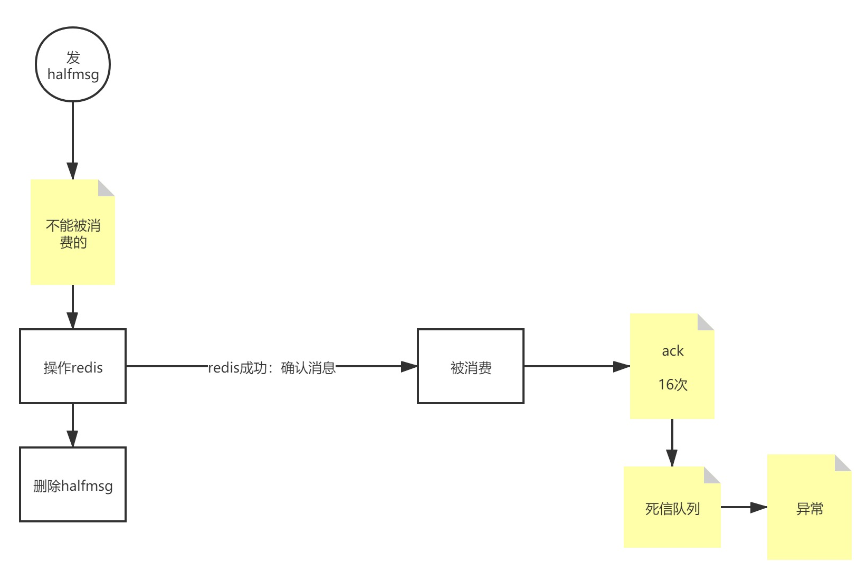

Get 自己项目中的亮点，自己最有成就感的事情。 

高性能，

对Hr好点

# 红包设计

红包业务： 发，抢

1. 发
2. **创建订单**
   1. 红包Id
   2. 钱
   3. 发送者
   4. 支付状态
   5. 已抢个数
   6. 时间等xxx
3. 支付

1. 抢
2. 判断余额
   1. 走，查看抢到的红包列表
   2. 余额足够，还要判断红包个数
3. 开
4. 更新红包记录
5. 红包流水
6. 记账
7. 结算入账

创建订单

​	红包Id，钱，发送者，支付状态，已抢个数，时间等xxx

红包流水表

​	流水表，红包ID ，拆红包用户，金额，时间

技术也为业务服务的

用户分组使用取模

程序如何切分一个块

实际的业务流程为先更新红包表（当多个请求同时修改该表时，数据库的行锁，会使对数据库表的操作变为串行的操作，浪费时间），

红包业务主要有两个表，一个是红包表，一个是红包流水表。

方案

1. 提前准备好对应人数的红包流水表。等抢的时候，直接更新红包流水。数据量大时不适用。
2. 也可以将抢红包的人进行分组，每组的人只能有一个人可以抢到。
3. 如果要保护数据的一致性，只能牺牲时效性。使用MQ
4. 也可以让在Redis里面抢，8核，32G
5. 使用RocketMQ:  先发消息队列，再发缓存。但是要使用half msg事务消息，包裹处理逻辑。

1. 减少客户端与服务端的交互
2. 将一行锁，分多行，提高并发
3. 通过内存数据库和MQ，分发压力
4. 通过事务消息，保证数据的一致性

红包雨：

​	消费端与消息中间件之间做好ACK防止幂等就可以了

幂等：

​	查询、删除不涉及幂等

​	添加和修改涉及幂等，PK主键，uK唯一索引，

1. traceid当前端重复提交是，后台在处理完后，放入redis，可以设置有效时间，比如10秒之内下次再来的时候，重复比较。[traceid只能前端生成，手机有imel值，串码，sim卡 ]  ，翻入redis后，可以过一段时间清楚
2. token: 处理当前的操作后，删除redis中的token，生成新的token，当幂等操作重复请求时由于旧的token已经在reids中删除过了，所以幂等操作不处理。
3. 还可以加分布式锁。
4. 幂等可以前置在网关中直接过滤掉。

​	

> 微服务链路优化，从哪几个方面回答?
>
> 1. 添加链路追踪，看看是哪几个链路节点慢，对接点进行优化
> 2. 如果还是不行，可以拆开链路，对后面进行操作进行解耦
>
> 所有的架构都是这几个方案，使用**redis**，**消息队列**
>
> 链路拆开，解耦，做无状态变化，能前置处理就前置处理。
>
> 路径要短，数据要少。

> 1. 定向用户：用户id和红包id
> 2. 运算，用户id和红包流水记录对上

