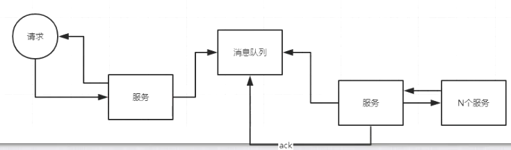

> redis总的设计
>
> ```shell
> 1. set a b nx ex 10  // 设置过期时间的值
> 
> 2. ttl a     // 获取当前 key的过期时间。
> ```
>
> 

分布式事务： 一致性，高并发

<font color="red">提高并发：大部分牺牲一致性</font>




lcn与seate


# 可靠消息一致性

特点：

​	并发量大（优势），

​	数据一致性不强（劣势）

>  可靠消息服务(自己开发的)

 

扣库存使用redis

金融业务一般使用的是T+1,现在因为有备用金所有，可以达到T+0；

seata（2PC,可能数据已）和Lcn适用数据一致性不高的情况。

2PC:

1. 单点故障
2. 数据不一致
3. 性能问题

# 消息事件加本地时间表


<font color="red">记录性的东西要详细</font>


