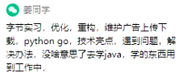
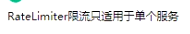
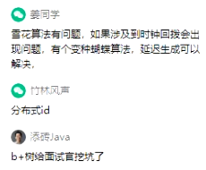

投简历时间：

​				10-10:30f分投

​				尽量在礼拜一、二、三投递

​				三点之后投放

简历如何去写：（如何买自己）

​				合理包装（20%）

​				适当隐藏


1. ArrayList与LinkList的区别
   1. ArrayList的实现是基于数组，LinkedList的实现是基于双向链表。 
   2. 对于随机访问，ArrayList优于LinkedList，ArrayList可以根据下标以O(1)时间复杂度对元素进行随机访问。而LinkedList的每一个元素都依靠地址指针和它后一个元素连接在一起，在这种情况下，查找某个元素的时间复杂度是O(n) 
   3. 对于插入和删除操作，LinkedList优于ArrayList，因为当元素被添加到LinkedList任意位置的时候，不需要像ArrayList那样重新计算大小或者是更新索引。 
   4. LinkedList比ArrayList更占内存，因为LinkedList的节点除了存储数据，还存储了两个引用，一个指向前一个元素，一个指向后一个元素。

2. Spring如何实现事物，实现实现事物的目的是什么。

   

3. 如何理解分布式锁，讲一个实际编程过程中实际遇到的分布式锁场景。

4. 写几个你了解的关于对称加密的加密方式和非对称加密的加密方式。

5. 讲一下你所理解的接口幂等性，或者说一下接口幂等性具体的应用场景。


​		

​	

---

# 录音

介绍自己

​		工作时间，工作负责，平时的兴趣。

​		进行项目介绍。

  1. 学校，哪年毕业，公司，业务

  2.  介绍要顺序介绍： 1,2,3说清楚

  3. 

  4. 

     



​	面试的时候谦虚一些


TSL 对称加密

建立握手后，通过CA证书进行认证。

TLS1.3

Http 2.0


全局唯一的ID生成器：分布式ID：雪花算法。




---

# 欧电云

HashMap

1. 数组链表转换
2. HashMap扩容过程
3. 触发扩容，扩容过程中做了哪些东西

Mysql

1. 聚簇索引与非聚簇索引

   ##### **什么是聚簇索引？**

   很简单记住一句话：找到了索引就找到了需要的数据，那么这个索引就是聚簇索引，所以主键就是聚簇索引，修改聚簇索引其实就是修改主键。

   ##### **什么是非聚簇索引？**

   索引的存储和数据的存储是分离的，也就是说找到了索引但没找到数据，需要根据索引上的值(主键)再次回表查询,非聚簇索引也叫做辅助索引。

2. # [inner join 与 left join 之间的区别](https://www.cnblogs.com/assasion/p/7768931.html)

Spring

1. Bean的作用域

   1. Singleton，这是 Spring 的默认作用域，也就是为每个 IOC 容器创建唯一的一个 Bean 实例。
   2. Prototype，针对每个 getBean 请求，容器都会单独创建一个 Bean 实例。
   3. Request，为每个 HTTP 请求创建单独的 Bean 实例。
   4. Session，很显然 Bean 实例的作用域是 Session 范围。
   5.  GlobalSession，用于 Portlet 容器，因为每个 Portlet 有单独的 Session，GlobalSession 提供一个全局性的 HTTP Session。考点分析

2. Bean默认是单例的怎么保证他的成员变量是线程安全的

   1.在Bean对象中尽量避免定义可变的成员变量；

   2.在bean对象中定义一个ThreadLocal成员变量，将需要的可变成员变量保存在ThreadLocal中

Mybatis

1. 通过写接口进行sql的调用

接口与sql的对应原理

---

# 司顺电商

1. FTP文件传输是基于下面哪种协议    <font color="red">TCP</font>
   1. TCP
   2. UDP
   3. Both A and B
   4. None of Above
2. 一个C类网最多可以容纳多少台主机 <font color="red">254</font>
   1. 128
   2. 254
   3. 255
   4. 256
3. 下面说法正确的是（）
   1. Java程序中的自动垃圾回收器阻止程序溢出内存
   2. **一段程序可以建议垃圾回收执行，但是不能强迫它执行**
   3. 垃圾回收是一个独立的平台
   4. **当一个对象的所有引用都被置空的时候，这个对象就可以变为能被垃圾回收**
4. 方法resume()负责恢复那些线程的执行
   1. 通过调用stop()方法而停止的线程
   2. 通过调用sleep()方法而停止的线程
   3. 通过调用wait() 方法而停止的线程
   4. **通过调用suspend()方法而停止的线程**
5. 关于sleep()和wait(),以下描述错误的一项是（）
   1. sleep是线程类Thread的方法，wait是object的方法
   2. sleep不释放对象所，wait放弃对象锁
   3. sleep暂停线程，但监控状态仍然保持，结束会自动恢复
   4. **wait后进入等待锁定池，只有针对此对象发出notify方法后获得对象锁进入运行状态**

简答题

1. 简述索引失效的几种情况

   1. 有or必全有索引
   2. 复合索引未用左列字段
   3. like以%开头
   4. 需要类型转化
   5. where中索引列有运算
   6. where中索引列使用了函数
   7. 如果mysql觉得全表扫表更快时（数据少）

2. RabbitMQ有几种工作模式

   1. 简单模式
   2. 工作队列模式
   3. 发布/订阅模式
   4. 路由模式
   5. 主题模式
   6. RPC模式

3. 请简述Redis有几种数据类型，及Redis过期策略和淘汰制

   数据类型

   1. String
   2. list
   3. hash
   4. set
   5. zset

   过期策略https://zhuanlan.zhihu.com/p/152643114

   1. **定期删除 + 惰性删除**

   内存淘汰机制

   1. noeviction:当内存不足以容纳新写入数据时，新写入操作会报错，这个一般很少用。
   2. allkeys-lru: 当内存不足以容纳新写入数据时，在键空间中，移除最近最少使用的key，这个是最常用的
   3. allkeys-random：当内存不足以容纳新写入数据时，在键空间中，随机移出某个key
   4. volatile-lru：当内存是不足以容纳新写入数据时，在设置过期时间的键空间中,移除最近最少使用的key
   5. volatile-random:当内存不足以容纳新写入数据时，在设置过期时间的键空间中，随机移除某个key。
   6. volatile-ttl：当内存不足以容纳新写入数据时，在设置了过期时间的键空间中，有更早过期时间的key优先移除。

4. 简述Java中常用的几种连接池

   dbcp2、alibaba druid、HikariCP

编程题

1. 用**递归**实现"vevor"字符串倒转

   ```java
    public static String reverse(String originStr) {
               if(originStr == null || originStr.length() <= 1) {
                   return originStr;
               }
               
               
               return reverse(originStr.substring(1)) + originStr.charAt(0);
           }
   ```

   

2. 一个有n级的台阶，一次可以走1级、2级或3级，问走完n级台阶有多少种走法。

3. 编写一个sql查询，查找所有至少连续出现三种的数字

   | Id   | Num              |
   | ---- | ---------------- |
   | 1    | 1 |
   | 2 | 1 |
   | 3 | 1 |
   | 4 | 2 |
   | 5 | 1 |
   | 6 | 2 |
   | 7 | 2 |
   | 8 | 1 |

   id是这个表的主键。

   例如，在运行你的查询语句之后，上面的person表应返回以下几行：

   | ConsecutiveNums1 |
   | :--------------: |
   |        1         |

   解：

   ```mysql
   create table logs (
   	id int AUTO_INCREMENT,
   	Num varchar(20),
   	PRIMARY key (id)
   );
   INSERT INTO LOGS (num)
   VALUES
   	(1),
   	(1),
   	(1),
   	(2),
   	(1),
   	(2),
   	(2),
   	(1)
   	
   	
   select distinct l1.Num as ConsecutiveNums
   from 
   Logs l1, 
   Logs l2, 
   Logs l3
   where l1.Id = l2.Id-1
   and l2.Id = l3.Id-1
   and l1.Num=l2.Num
   and l2.Num=l3.Num
   ```

   

   

   

   

4. 编写一个SQL查询，来删除Person中所有重复的电子邮箱，重复的邮箱只保留id最小的那个。

   | id   | Email            |
   | ---- | ---------------- |
   | 1    | john@example.com |
   | 2    | boob@example.com |
   | 3    | john@example.com |

   id是这个表的主键。

   例如，在运行你的查询语句之后，上面的person表应返回以下几行：

   | id   | name             |
   | ---- | ---------------- |
   | 1    | john@example.com |
   | 2    | bob@example.com  |

   解：

   ```mysql
   create table Person(
   	id int auto_increment,
   	Email varchar(20),
   	primary key (id)
   )
   
   INSERT INTO person (email)
   VALUES
   	('john@example.com'),
   	('boob@example.com'),
   	('john@example.com')
   	
   Delete
   	a
   from
   	Person a,
   	Person b
   where
   	a.email = b.email and a.id>b.id
   ```

   


