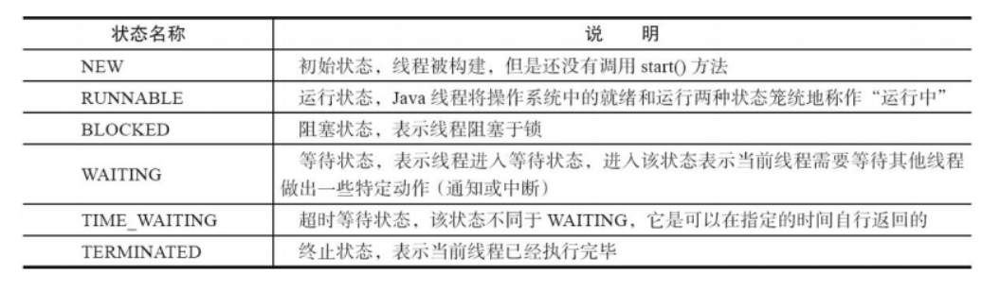
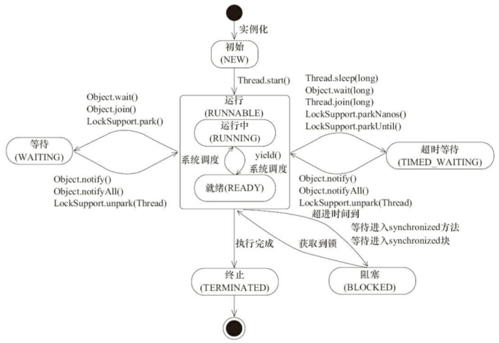
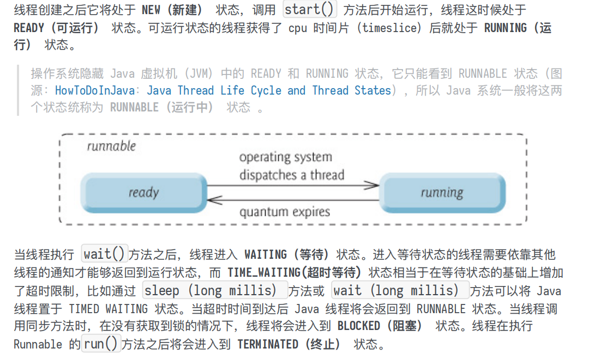

# Java 基础

## 1、Java混合执行   （解释执行(慢)与编译执行(快)）

## 2、String         StringBuffer    和  StringBuilder 的区别 ，String 为什么是不可变的

### 可变性

String 类中使用  final 关键字修饰字符数组来保存字符串，  **private final char value[]** 

​			在Java9之后，String的实现  改为 byte数组存储字符串  private final byte[] value

⽽ StringBuilder 与 StringBuffer 都继承⾃ AbstractStringBuilder 类，

在**AbstractStringBuilder** 中也是使⽤字符数组保存字符串 **char[]value 但是没有⽤ final 关键字修**

**饰，所以这两种对象都是可变的**

### 线程安全性

​	**String**  中对象是不可变的，也就可以理解为常量，线程安全。

​	**StringBuffer**对方法加了同步锁或者对调用的方法加了同步锁、所以线程是安全的

​	**StringBuilder** 并没有对方法进行加锁同步，所以不是线程安全的。

	> AbstractStringBuilder 是StringBuilder 与 StringBuffer 的公共父类，定义了一些字符串的基本操作，如 expandCapacity、append、insert、indexOf等公共方法。

### 性能

​	String 类型进行改变的时候，会生成一个新的String 对象，然后将指针指向新的String对象。

​	StringBuffer每次都会对StringBuffer 对象本身进行操作，而不是生成新的对象并改变对象引用。

​	StringBuilder相同情况下相比使用StringBuffer 仅能获得10% ~15%左右的性能提升，但却要冒多线程不安全的风险。

### 对三者的使用总结:

	1. **操作少量**的数据：使用**String**
 	2. **单线程**   操作字符串缓冲区 下 操作大量数据：适用    **StringBuilder**
 	3. **多线程**   操作字符串缓冲区 下 操作大量数据：适用    **StringBuffer**(对方法加了同步锁)

##  3、⾃动装箱与拆箱

https://www.cnblogs.com/dolphin0520/p/3780005.html

## 4、接⼝和抽象类的区别是什么？

1. **接⼝**的⽅法默认是 **public**，所有⽅法在接⼝中不能有实现(Java 8 开始接⼝⽅法可以有默认实
   现），⽽抽象类可以有⾮抽象的⽅法。

2. **接⼝中除了 static、final 变量，不能有其他变量，⽽抽象类中则不⼀定。**
3. **⼀个类可以实现多个接⼝**，但**只能实现⼀个抽象类**。接⼝⾃⼰本身可以通过 extends 关键字扩
展多个接⼝。
4. 接⼝⽅法默认修饰符是 public，抽象⽅法可以有 public、protected 和 default 这些修饰符
（抽象⽅法就是为了被重写所以不能使⽤ private 关键字修饰！）。
5. 从设计层⾯来说，**抽象是对类的抽象，是⼀种模板设计**，⽽**接⼝是对⾏为的抽象，是⼀种⾏为的**
**规范。**

>1. 在 jdk 7 或更早版本中，接⼝⾥⾯只能有常量变量和抽象⽅法。这些接⼝⽅法必须由选择实现接⼝的类实现。
>2. jdk8 的时候接⼝可以有默认⽅法和静态⽅法功能。
>3. Jdk 9 在接⼝中引⼊了私有⽅法和私有静态⽅法。

## 28. 为什么 Java 中只有值传递？

https://juejin.cn/post/6844904045426016263

## \30. 线程有哪些基本状态?

**由图可以看出**

> **对象存于堆内存，如果局部变量类型为基本数据类型，那么存储在栈内存，如果为引⽤数据类型，那存放的是指向堆内存对象的引⽤或者是指向常量池中的地址。**

> 一闪
>
> 1. Java的面向对象编程
> 2. Java中的多态