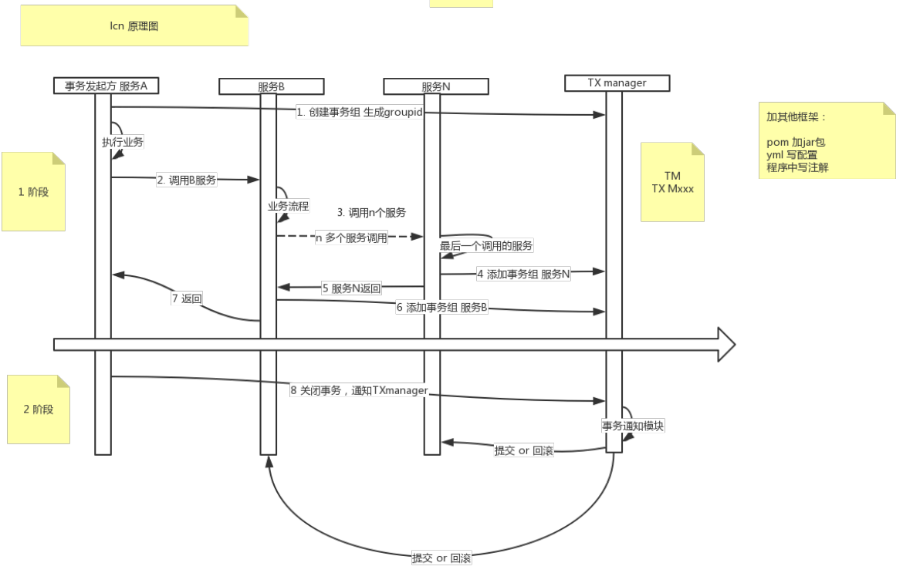

# Eureka

map<服务名，map<实例id，实例信息>>

```
ConcurrentHashMap<String, Map<String, Lease<InstanceInfo>>>
```


**优化**

```sh
 server:
  	# 自我保护，看服务多少。
    enable-self-preservation: false
    # 自我保护阈值
    renewal-percent-threshold: 0.85
    # 剔除服务时间间隔
    eviction-interval-timer-in-ms: 1000
    # 关闭从readOnly读注册表
    use-read-only-response-cache: false
    # readWrite 和 readOnly 同步时间间隔。
    response-cache-update-interval-ms: 1000
```

## cap 

1.三级缓存。

**2.从其他peer拉取注册表。peer。int registryCount = this.registry.syncUp()，没有满足C的地方。**

3.P：网络不好的情况下，还是可以拉取到注册表进行调用的。服务还可以调用。


100     80， 20挂了。1个没挂，但是网络抖动了。

不剔除这1个了。


## 自我保护剔除：eureka 优化

1. 开关
2. 阈值

## server源码。

剔除（本质也是下面的下线）。长时间没有心跳的服务，eureka server将它从注册表剔除。√

注册。√

续约。√

下线。√

集群间同步。√

拉取注册表。（all-apps,apps-delta,服务名）

```sh
Lease<InstanceInfo>租约     InstanceInfo服务实例
```


收到服务实例，保存。心跳时间，xxx时间。


服务实例，有 xxxx时间。

class 租约{

​	long 到期time;

​	long 续约时间time;

​	long 心跳时间time;

​	T 服务实例 holder。setter

}


后面续约：频繁。

# 灰度发布-网关发布

1. 蓝绿发布
2. 滚动发布（会出现替换时老系统报错）
3. 灰度发布（金丝雀发布）

通过比例控制请求版本：比如100个请求过来后，百分之七十的继续请求老服务，百分之30%继续请求新服务。

> 腾讯系： 允许失败，允许适度浪费，内部竞争
>
> A/B Testing     α、β版、内测公测

1. 指定灰度规则、区分哪些用户、走哪些服务（boos后台录入）

区分老服务新服务

URL 中加版本

网关上加路由

上面两个太过复杂： 最朴素的一个道理

server中添加 eureka.instance.metadata-map

​                       version: v1  ; spring.profiles: v1

动态修改元数据： github.com/netfix/eureka/wiki/Eureka-REST-operations

网关中的实现： 在Cloud-zuul 中的路由

filter 中  class graFilter extends zuulFilter   重写方法

2. 预制规则代码
3. 修改元数据（通过url热修改自定义元数据）

灰度发布

> 1. 网关（实现的是网关到服务的灰度）
>
> 2. ribbon灰度（实现的是服务到服务的灰度）
>
> Guava cache
>
> guava 集合的filter  Java 8 的流式操作

> IDEA 中
>
> 使用DataBase 连接数据库 反向 实例化数据库生成 JavaEntity 与 Mapper.xml
>
> mybatisgenenter
>
> jhipster
>
> mybatis plus
>
> jhipster

# 灰度发布 - ribbon 灰度

灰度方案1：zuul的灰度实现

用类似于权重分配，根据用户ID

过滤器

zuul 过滤器，filter 路由的时候，根据灰度规则选一个适合的服务

ribbon(Irule) Loadblancer 

1. 自定义Rule规则（根据用户信息，选择不同的服务进行分发）

   class GrayRule extends AbstractLoadBalancerRult

   重写Choose 方法

   使用ThreadLocal 来获取用户信息，一般使用ThreadLocal 的get、set方法

   set在IRule之前，使用aop切面增强

   ```java
   @Aspect
   @Component
   class RequestAspect{
       @PointCut("execution(* com.zeron.contriller,*Controller.*.*(...))")
       @Before(value="any/nethod()")
   	HttpServfetRequest = RequestContextHolder.getRequest();
   }
   ```

具体流程：

1. 客户端请求
2. 拦截请求：获取用户（token） 解析到用户的id,tag(标签)
   1. 下一步和 灰度规则做匹配
3. 第一步：自定义rule规则（根据用户信息，选择不同的服务进行分发），拿到自定义元数据metadata.
   1. 下一步和 灰度规则做匹配

> ThreaLocal ,mybatis 连接池，事务
>
> 可以使用ThreadLocal 来保护线程资源的一致性， jmrarloch jhipster
>
> 如切面AOP,ThreadLocal,  ribbon 自定义Rule
>
> ---
>
> AOP：日志、统计、qps、tps（开始时间qpt，开始-结束的tps）
>
> ​			除了本职工作之间的额外事情
>
> ​			鉴权、拦截异常、自定义注解、功能扩容
>
> <font color="red"> 提前预付系统的用户量，针对服务进行测压（限流） </font> 


# 灰度面试-网关敏感信息 -- 传统项目向微服务改造的问题

> 前情回顾:
>
> 2类：
>
> ​	io.jmnarlxxx
>
> ​	自定义的filter和rule
>
> 小步快跑，快速迭代

项目经验

> 个人职责：负责灰度发布的架构方案和落地，并且负责核心代码的编写。实现了网关和服务，服务和服务之间的灰度发布
>
> （rule, filter , 在某某行代码，加了xxxx）
>
> 面试guan： 怎么做的？
>
> 1. 解决的问题是什么？ 为什么要灰度发布。（实现新功能 a  b  texting， 小改动的服务不用熬夜（尽量减少用户使用的时间延迟），便于小步快跑。我们遇到的问题）
> 2. 怎么解决的
> 3. 为什么要这么解决（蓝绿发布，滚动发布xxx, 灰度发布）
> 4. 给公司带来的好处（节省了服务器，节省了延时，试错成本）
>
> ---
>
> 如何验证？ prod , prd , online， 生产

---


zuul 生产中的问题：

1. tonken不向后传（单体项目->  微服务 ）
2. 老项目改造中，路由问题。（原来url不能变，通过网关去适应）
3. 动态路由（根据不同用户 ->  不同服务）

网关要做的事情：

1. 分发服务
2. 身份认证（鉴权）
3. 过滤请求
4. 监控
5. 路由（动态）
6. 限流
7. nginx 负载均衡
   1. nginx 服务器端，zuul客户端

> 最小知道原则： 安全原则。3个人知道，第四个人不要知道

<font color="red">当你有拷贝的欲望的时候，就该考虑设计的合理性了。\n  后面服务要做 重复做的事情，可以放到网关来做</font>

> Spring Boot 中 Controller 是不是到单例

> 提高 TPS:
>
> ​				加大并发，减少相应时间
>
> ​				AKF 
>
> ​				减少IO次数


# 灰度发布  zuul  过滤器：解决实际问题思路分析

<font color = "red"> 写Filter 步骤：</font>

1. 集成zuulFilter
2. public boolean shouldFilter();   
   1. true: 执行此过滤器 
   2. false: 不执行
3. run() ： 过滤器的业务逻辑
4. filterFype: 当前过滤器的级别
   1. PRE： 请求被路由之前调用
   2. route：请求路由到微服务
   3. Post：调用微服务执行之后
   4. Error：其他阶段发生错误
5. oder(): 设置当前过滤器的级别；  数字越小，越先执行。


> nginx流量网关
>
> zuul业务网关
>
> nginx 服务网关
>
> zuul 客户端
>
>  zuul  Fitler 转发
>
> nginx 入口，zuul/gateway 来转发服务 RPC
>
> 注册中心弱化?
>
> CPU 中央处理器 CPU---- Central Processing Unit
>
> Spring 中的Processer为真正处理的地方

---

1. Filter 使用灰度的方式 修改 url

    做好老Url 和新Url 对应关系

2. nginx (地址映射)

3. zuul 自定义filter

> zuul  约等于  一些列过滤器
>
> 有四种过滤器：
>
> 1. pre
> 2. route
> 3. post
> 4. error
>
> 四种的执行顺序
>
> PRE：在请求被路由之前调用，可利用这种过滤器  鉴权， 选择微服务，记录日志，限流
>
> ROUTE：在将请求路由到微服务调用，由于构建发送给微服务的请求，并用http clieent  (或者ribbon) 请求服务区。
>
> POST： 在调用微服务执行后，可用于添加header, 记录日志，将响应发给客户端
>
> ERROR：在其他阶段发生错误，走此过滤器

> 公司内部网关，也是做到和zuul类似的事
>
> 路由都是在配置文件配的

Route 有几种，具体做什么事？

三种：

1. RibonXXXFilter: 路由到服务
2. SimpleHostRountingFilter：路由到url地址
3. SendForWardFilter:  转发（转向zuul自己）

# 网关 ，经典动态路由，问题解决的2中方案

1. 过滤器，route

2. 获取请求过来的url (请求)
3. url (请求) = url（目的地）映射
4. 设置RequestContext 中的 serviceId  , url

> 开发之前，想清楚步骤
>
> 技术和业务 做 选择和取舍。（100中方法，取一种适合的，自己扛）

AKF对应坐标轴上的xyz

xyz(手机去手机堆里搜索，不去去衣服里面搜索)

X ： 水平复制

Y：服务拆分

Z：数据分片


1. 动态路由     根据不同用户  ->  不同服务

> 404 找不到地址
>
> ====
>
> 网关的地址来源
>
> 1. eureka 服务，zuul从 eureka获取的服务
> 2. 配置文件中定义（yml.perproties）

读取配置文件

```java
@Component
@propertySource(value={"classpath:application-my.yml"})
@ConfigurationProperties(prefix="zero")
@Data
public class Myyml{
    @Value("${xxx}")
    private String xxx;
}
```


网关的应用

在不修改url的情况下转发调用服务

在使用zuulFilter, TYPE-Router 这种方式

记得设置Servers_ID

---

# 网关动态路由----解决方案

> 可以节省计算资源
>
> 过滤器设计的顺序

网关本质 过滤器

1. should  是否执行该过滤器
2. run  业务处理
3.  filtertype  过滤器属性
4. order 过滤器书顺序

网关调用500时处理

```java
public class MabFallback implements FallbackProvider {
	String getRoute();
	ClientHttpResponse fallbackResponse (String route , Thrwble cause);
}
```

DB中存储  ShouldFilter 过滤器的开关

可以后台管理中配置过滤器的开关

API 接口根据不同权限的用户，设置调用次数，权限

微服务添加 actuator包

> /actuator/routes   可以查看路由的查看  

---

可以在后台管理系统上配置过滤器开关，boss

目的：不重启，让过滤器生效

============

拉新，要求用户量，设置黑名单过滤器（）

=======

开放平台API，随便调用，500次，开关。（技术+业务）

========

ip和设备没有做过多的限制

---

路由规则的查看

> http://localhost:9100/actuator/routes
>
> POM
>
> ```yml
> <dependency>
> 	<groupId>org.springframework.boot</groupId>
> 	<artifacId>spring-boot-starter-actuator</artifacId>
> </dependency>
> ```
>
> yml
>
> management:
>
> ​	endpoints:
>
> ​		web:
>
> ​			wxposure:
>
> ​				include: "*"
>
> ​	endpoint:
>
> ​		health:
>
> ​			 默认是never
>
> ​			show-details: ALWAYS
>
> ​			enabled: ture
>
> ​		routes:
>
> ​			enabled: true
>
> 过滤器的查看： http://localhost:9100/actuator/filters

IP 过滤，次数限制，设备号过滤， pre过滤

```java
RequestContext.getCurrentContext().sendZuulRespons()   |-> 获取ThreadLocal
```

通过pre设置true/false,控制是否在后面的route,post ,error的操作执行

```java
RequestContext.getCurrentContext().sendZuulRespons(false) 只控制 不向 route 过滤器执行，因为ribbonrouterfilter 的shouldFilter判断了 sendZuulResponse 条件。
四个过滤器  pre,route ,post ,error
```

<font color="red">过滤器，也算是网关过滤器一个优化点</font>

zuul 自身过滤器也用过是 ctx.SendzuulResponse()进行判断

ZuulProxyAutoConfiguration

zuulServerAutoConfiguration

过滤器 中shouldFilter 可以发挥很多的作用


# 网关实战小技巧

限流：

1. 网关限流         extends  zuulFilter   pre
2. 每个服务的限流   inplements Filter(Java.serlvet)

不限流，恶意攻击时，无法保证服务可用。

 

令牌桶算法

通过此算法限制流量

令牌生成器生成令牌，比如最大值为10个，超过最大值的进行丢弃，看调用方能否拿到令牌，拿到进行正常业务，拿不到拒绝服务

<font color="red">使用 Apache  JMeter 进行并发测试</font>

<font color="red">gavar  中的 RateLimiter RATE_LIMITER = RateLimter.create(2)</font>

> 预估用户量  qps, tps, 1000
>
> 测试去压测， 标准 1000
>
> 后端是可以比 网关的流量大一点

网关限流  主要为 ：

1. 生成令牌
2. 使用令牌

1. 使用google 的gavar 的RateLimiter RATE_LIMITER = RateLimter.create(2)
2. 使用Alibab的 Sentinel

1. 生成令牌

```java
//  所有限流规则的集合  在 ZuulApplication中main() 加入
List<FlowRule> rules = new ArrayList<>();
FlowRule rule = new FlowRule();
//  资源名称
rule.setResource("HelloWorld");
//  限流的类型
rule.setGrale(RuleConstant.FLOW_GRADE_QPS);
// 2、qps
rule.setCount(2);
rule.add(rule);
FlowRuleManager.LoadRules(rule); //  将规则添加进管理器
```


---

# 分布式事务

> 1. 二阶段提交
> 2. 三阶段提交
> 3. TCC
> 4. 最终一致性
> 5. Seate
>
> CAP 无法满足，只能满足CP或者是 AP

面试题： 在一台机器上，db本地事务如何保证

答：**锁**， **Undolog**,**redo**,**undo**

> 红锁： 是分布式锁
>
> 柔性事务

> ​	ACID    
>
> A  (Atomicity)  原子性
>
> C（Consistency）一致性
>
> I （Isdation）隔离性   **串行 ☆**
>
> AD  日志文件
>
> CI   锁

数据库写数据之前先写日志文件，在写数据文件

如果数据提交数据库中没有 将执行redo操作

如果数据没有提交 则 undo操作，也称为 反向操作

比如  insert 反向 deleter ,update  1 -> 2  反向操作为  update 2 -> 1

<font color="red">读未提交，读已提交，可重复读，串行化 ---导致---->  脏读，重复读，幻读</font>

分布式事务的两个理论： 

1. 刚性事务  ACID    事实一致性
2. 柔性事务  BASE    最终一致性

XA（协议|接口）：TM（Transtion Manager）事务管理器、RM（Resource Manager）资源管理器


<h1>2PC</h1>

> 缺点：
>
> 1. TM单点故障
> 2. 阻塞资源
> 3. TM挂了造成的数据不一致


<h1>3PC</h1>

> 三阶段是提交，添加了询问操作（提升可靠性，无法完全解决），确保网络，服务可用
>
> 并添加了超时机制，处理超时状况


2PC 发生小概率异常

服务1 提交后，服务2 挂了

进行补偿：人工补偿、定时补偿、脚本补偿、向前sql、向后sql

> Mybatis 原理使用 ThreadLocal 做的事务，保证这次提交的事务，是原来提交的那个事务

2PC是资源锁定

3PC的第一阶段不锁定资源

3PC降低了锁定资源的概率和时长

a. come Commit 资源不锁定

b.TM 协调者和RM资源拥有者的超时处理机制 超时默认提交

TM：未收到反馈，给RM发中断事务的命令

RM：在3阶段，没有收到TM的命令，我默认提交

XA Connection（基于JDBC规范的XA的实现思路（~~ATOMIKOS~~）） =多个连接

> 阿里全局事物服务 GTS, 底层  seata

<h2> 2PC vs 3PC</h2>

> 2 PC 只有TM有超时
>
> 3PC  TM.RM 都有超时
>
> 3PC 不能解决2PC的问题，只能降低灾难发生的概率
>
> 1. 引入超时机制，同事在协调者（超时，终端事物）和参与者（超时,在pre中断，在do提交）中都引入超时机制
> 2. 在第一阶段和第二阶段中插入一个准备阶段，保证了在最后提交阶段之前各个参与节点的状态是一致的。

# 消息对列-定时任务-本地事件表

> 2pc,3pc,消息对列+事件表，TCC, 可靠消息最终一致性，最大努力通知，
>
> 落地实现是：消息对列，seata

<font color="red">消息队列+事件表：不适用：数据量特别大</font>

<font color="red">第三方回调过来：根据第三方的数据结构，先把他存下来</font>

> 幂等： 通过消息事件的ID，主键约束来保证消息重复消费的问题。


> 事件表：历史表（冷热数据）

ActiveMQ 要配置死信队列

定时任务 要么用**分布式定时任务**，要么用**分布式锁**

事务注解：

1. @Transactional (rollbackFor = Exception.class)
2. @EnableJMS
3. @EnableScheduling

ACK设置DefaultJmsListenerContainerFactory.setSessionAcknowledgeMode(2)

1. 自动确认
2. 客户端手动确认
3. 自动批量确认
4. 事务提交并确认

消费端没用事务是通过重复消费消息来保证的

ActiveMQ 重复消费6次不成功，消息进入死信队列

​				死信队列，消费一次就结束了，可以自己设计私信对列补偿机制

# LCN ---  Lock Confirm Notify   原理   --- 实战

Lock  锁定事务单元

Confirm  确认事务

Notify  通知事务

**LCN 不是真正的2pc**


XA 协议 Oracle (xa Connection)  数据库驱动提供

​					对应

1. 应用程序
2. 事务管理器
3. 资源管理器
4. 通信管理器

一般框架都是两个阶段，LCN类似于两个阶段

加其他框架： 1. pom 加 jar  包

​						2. yml  写配置

​						3. 程序中写注解

<font color="red">Spring 事务 与 mybatis 事务</font>


**LCN原理图**

**协调机制本质**：代理了DataSource的机制，保持了请求和db连接的对应

<font color="red">保留第一阶段操作的db连接池的连接</font>

**补偿机制**：做标识，做记录（通知的具体事项，或者需要执行sql的操作）

FxClient 中 @LcnTransation   @EnableDistributedTransaction

LCN 三种事务模式：**LCN**,**TCC**,**TXC**


<h1>LCN 原理 | 事务控制原理</h1>




以手绘的原理图为准:

核心步骤：

1. 创建事务组

   是指在事务发起方开始执行业务代码之前，先调用下TxManager 创建事务组对象，然后拿到事务指示GroupId的过程

2. 加入事务组

   添加事务组是指参与方在执行完业务方法以后，转换模块的事务信息通知给TxManager的操作

3. 通知事务组

   是指在发起方执行完业务代码之后，将启动方执行结果状态通知给TxManager，TxManager将根据事务最终状态和事务组的信息来通知相应的参与模块提交或回滚事务，并返回结果给事务发起方。


---


LCN 实操整理，pom、配置、注解

TmAtuoCluster

partyacrain

TM集群

TC中配置多个TM地址

----

# TCC -- Try Confirm  Cancel  -- 原理  -- 实战

<font color="red">不要为了极低概率的时间，增加研发成本</font>

TCC

更换注解  @TccTransaction

不用写注解，并写上  ConfirmMothed  正常（什么也不做） 、CancelMothed 报错（逆sql）

@TccTransaction 中自动识别

key: 简单，机器+线程+方法

> 用自带事务的中间件、比如mysql,不用tcc,用LCN 
>
> 没必要还增加了业务的复杂度

场景：

mongDB（不带事务）

redis ：写入磁盘，有删除的情况

一个有事务，一个没有事务，或者都没有事务时，使用**TCC**

使用场景：

带事务的中间件比如  mysql 等：		**LCN**

其他没有事务的中间件： 比如 redis  : **TCC** （工作量太复杂，太大）

MySQL+redis 混用事务

LCN 与TCC 可以混合使用

> AOP   动态代理，静态代理  Cglib

LCN本质：DataSource代理，代理Connection(连接)  ,  LcnConnectionProxy.java

源码： DataSourceAspect.

代理连接：DataSourceAspect,LcnComectionProxy

Spring 中看源码，全局搜索注解：比如LcnTransaCtion

主要类： DTxServiceExecutor.

TCC 造成脏读，框架会重试，也可以直接写补偿。


**实现**

官方：

```text
https://www.codingapi.com/docs/txlcn-setting-distributed/
```


# TM

协调器。

## pom

```xml
<!--tm-->
        <!-- tm  manager -->
        <dependency>
            <groupId>com.codingapi.txlcn</groupId>
            <artifactId>txlcn-tm</artifactId>
            <version>5.0.2.RELEASE</version>
        </dependency>

        <dependency>
            <groupId>com.codingapi.txlcn</groupId>
            <artifactId>txlcn-tc</artifactId>
            <version>5.0.2.RELEASE</version>
        </dependency>
        <dependency>
            <groupId>com.codingapi.txlcn</groupId>
            <artifactId>txlcn-txmsg-netty</artifactId>
            <version>5.0.2.RELEASE</version>
        </dependency>
        <!--tm-->
```

## yml

```yml
# TM事务管理器的服务端WEB访问端口。提供一个可视化的界面。端口自定义。
server.port=7970

# TM事务管理器，需要访问数据库，实现分布式事务状态记录。
spring.datasource.driver-class-name=com.mysql.cj.jdbc.Driver
spring.datasource.url=jdbc:mysql://localhost:3306/tx-manager?characterEncoding=UTF-8&serverTimezone=Asia/Shanghai
spring.datasource.username=root
spring.datasource.password=root

# TM事务管理器，是依赖Redis使用分布式事务协调的。尤其是TCC和TXC两种事务模型。
spring.redis.host=127.0.0.1
spring.redis.port=6379
spring.redis.database=0

# 为spring应用起名。
spring.application.name=tx-lcn-transaction-manager

# TM事务管理器，提供的WEB管理平台的登录密码。无用户名。 默认是codingapi
tx-lcn.manager.admin-key=msb
# 日志。如果需要TM记录日志。则开启，赋值为true，并提供后续的配置。
tx-lcn.logger.enabled=true

# 为日志功能，提供数据库连接。和之前配置的分布式事务管理依赖使用的数据源不同。
tx-lcn.logger.driver-class-name=com.mysql.cj.jdbc.Driver
tx-lcn.logger.jdbc-url=jdbc:mysql://localhost:3306/tx-manager?characterEncoding=UTF-8&serverTimezone=Asia/Shanghai
tx-lcn.logger.username=root
tx-lcn.logger.password=root
```


## java

启动类

```java
@EnableTransactionManagerServer
```


业务类

```java
tm 没有业务类。
```


# TC

## pom

```xml
<!-- lcn -->
        <dependency>
            <groupId>com.codingapi.txlcn</groupId>
            <artifactId>txlcn-tc</artifactId>
            <version>5.0.2.RELEASE</version>
        </dependency>

        <dependency>
            <groupId>com.codingapi.txlcn</groupId>
            <artifactId>txlcn-txmsg-netty</artifactId>
            <version>5.0.2.RELEASE</version>
        </dependency>
```

## yml

```yml
tx-lcn:
  client:
    manager-address: 127.0.0.1:8070  # tm地址
```


## 启动类

```java
@EnableDistributedTransaction
```

## 业务类

```java
@LcnTransaction
```


---

# 分布式事务解决方案  Seata   AT 模式

分布式事务：

​	2pc、3pc、消息对列+本地事务表+定时任务、LCN、TCC

<font color="red">高并发分布式事务：消息对列《可靠消息服务》</font>


Seate  大概2pc  -- Simple ExtenSible Autonomous Transaction Architecture

TC -- Traction Coordinator  --  事务协调者

TM:  事务发起者  （管理者）

RM:  资源管理者 （每个参与事务的微服务）

> 本地锁  +  全局锁
>
> 本地锁之前先获取全局锁

seata 支持的事务模式：  AT、TCC、SAGA、XA

项目创建：

1. 下载seate 中间件

   配置register./Filter

2. 项目中配置
3. 数据库脚本  seata 数据库  ， undo.log表

> 看源码找熟悉的关键字，
>
> 2. debug 日志中查看
> 3. 看注解

LCN 与 seata 吞吐量差

消息对列+本地事件表

业务系统+事务消息

可靠消息服务

---

# 可靠消息服务  ----  最大努力通知  ---  事务消息

可靠消息最终一致性发方案：  不适用于实时业务

> 把整条调用链路变成了： 调用单体的单个功能


优势：吞吐量大，响应快，增加并发量，压力主要在**可靠服务之前**

---

最大努力通知：

​		应用场景：我方调用第三方：应用在第三方系统调用中

​							第三方开发：属于第三方开放平台

		1. 尽最大努力通知
  		2. 你来找我要

---

结合事务消息

> 事务中：（业务表额外加一个  事务表 （tld  messageid ,自己生成））思路


# 总结分布式事务：

2pc(协调者超时 回滚，占用连接，)

3pc (2pc的第一阶段 拆成了 2个阶段，协调者和参与者都超时，pre超时是回滚，do 超时是提交)。

tcc（2pc的第二阶段 拆成了2个阶段，不占用连接，性能高，但是麻烦）(简单业务可以tcc)。

lcn(lcn,tcc)(代码)

seata(at,tcc)（代码）

消息队列+本地事件表（代码）

最大努力通知

可靠消息服务

消息事务（代码）


----

# 分布式锁

服务网格 

edas中集成Nacos

JMeter

redis集群：一主 二从 三哨兵

RedLock

@Quauar

@primary

---

分布式锁

<font color="red">程序员的效率来源于需求、异常也可以做业务</font>

手写redis锁

Lua脚本锁

红锁：过半加锁、 1 、2、 3(崩溃重启，大于加锁的有效期)、 4、5

Cloud锁， 将锁写成注解，通过AOP添加注解

红锁、ZK、etcd

秒杀： 并发读，并发写、链路追踪

> 分布式锁特点
>
> 互斥性
>
> 防死锁
>
> 自己解自己的锁
>
> 容错性质，几个redis


# 总结

计价代码

技术评审-计价规则

任务-规则

服务网格：

​	技术点---> 应用

​	alibaba  --->  应用

​	datax

​	activeib

**稳定性  ZK**

性能  reids

zk  + Dobuo

动态可插拔 seata

<font color="red">技术框架，自己的思维书</font>


